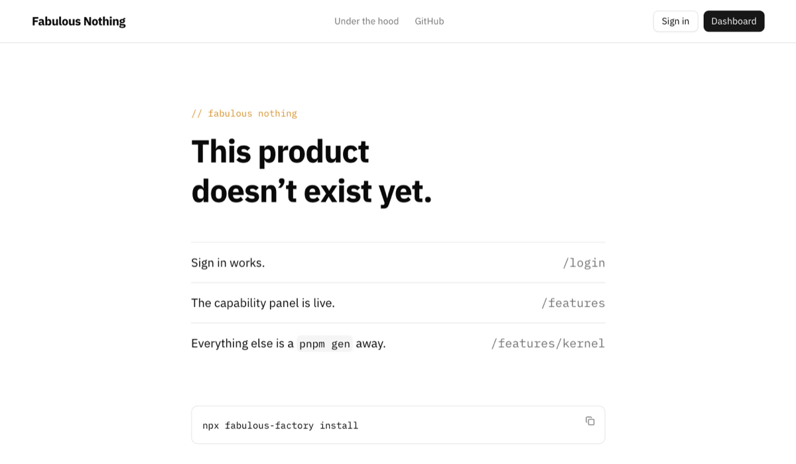
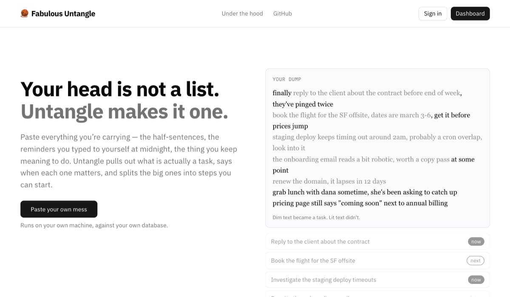
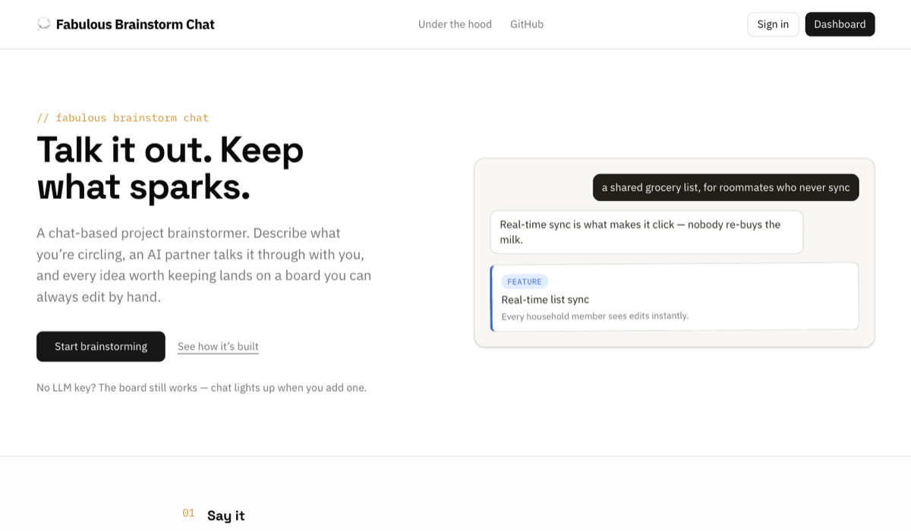

<div align="center">

# 🏭 Fabulous Factory

### The Next.js starter built for agent-driven development.

**Your agents can't wreck auth, billing, or your database — because the repo won't let them.**

> _The human states intent, the agents do the work, the repository enforces the rules._

<br/>

[](https://www.npmjs.com/package/fabulous-factory)
[](LICENSE)
[](https://nextjs.org)
[](https://www.typescriptlang.org/)
[](https://www.postgresql.org/)
[](https://orm.drizzle.team/)
[](https://www.conventionalcommits.org/en/v1.0.0/)
[](CONTRIBUTING.md)

<br/>

[**Open in Codespaces**](https://codespaces.new/marzapower/fabulous-factory)

</div>

---

## Why this exists

You want a real SaaS running — signup, login, payments, background jobs, transactional
email, analytics, error tracking — without spending the next three weeks wiring auth or
arguing with your agent about how to handle a webhook. This repo gives you that skeleton,
already built and already talking to itself, so you can skip straight to the part only
you can do: deciding what your product actually is. You state intent, your agents build
it, and the repo makes that safe — because
[Veracode's 2025 GenAI Code Security report](https://www.veracode.com/blog/genai-code-security-report/)
found that **45% of AI-generated code samples failed security tests and introduced OWASP
Top 10 vulnerabilities**, and a solo founder isn't going to catch what a senior reviewer
would.

Every other starter answers this with prose — a `CONVENTIONS.md` the agent reads,
forgets, and violates by Tuesday. Fabulous Factory answers it with **structure**:

```ts
// ❌ This does not exist. It doesn't lint. It doesn't merge.
export async function POST(req: Request) { ... }

// ✅ This is the only way to declare a handler — and it MAKES you decide:
export const POST = defineHandler({
  auth: 'required',            // ← mandatory. No default. No forgetting.
  input: createCaptureSchema,  // ← zod-validated before your code runs
  rateLimit: { windowSeconds: 60, max: 20 },
  handler: async ({ session, input }) => { ... },
});
```

That's the whole philosophy: **what is mechanical must never be probabilistic.**

**Start here**

1. Quickstart below (5 minutes).
2. Open the running app — the home page and `/features/*` pages are the guided tour, live.
3. Ask your agent: _"what's left to make this mine?"_

## ⚡ Quickstart

```bash
npx fabulous-factory@latest install     # or: pnpm create fabulous-factory
cd my-saas
cp .env.example .env
openssl rand -hex 32       # → paste as BETTER_AUTH_SECRET in .env
# set DATABASE_URL too, then:
pnpm dev                   # migrations self-apply; you're running.
```

The installer walks you through picking a **preset** — a product shape — and scaffolds a
repo that's already yours: common infrastructure, your chosen app, and your agent's
instruction set, all installed. Three presets ship:

<table>
<tr>
<td width="33%" valign="top">

**Fabulous Nothing**

A blank slate: homepage, capability pages, auth, and an empty dashboard, with no example
domain to rip out.



</td>
<td width="33%" valign="top">

**Fabulous Untangle**

A full working micro-SaaS: paste messy text, get it captured, normalized, and turned
into a daily plan.



</td>
<td width="33%" valign="top">

**Fabulous Brainstorm Chat**

A per-user project brainstormer: an LLM chat that streams prose and proposal cards you
accept or dismiss onto an Ideas/Features/Notes board.



</td>
</tr>
</table>

Then ask your agent: _"what's left to make this mine?"_

<details>
<summary>Environment setup details — Postgres and a Better Auth secret, everything else optional</summary>

Prefer not to run Postgres yourself? `docker compose up` boots the database (and
everything else) for you — see [Run with Docker](#run-with-docker) below. Or skip the
toolchain entirely: **Open in Codespaces** boots the app + Postgres in your browser, zero
local setup.

Billing, LLM, email, jobs, analytics, and error tracking are all optional and light up
later via env vars — nothing above is required to get running.

</details>

**Or skip local setup entirely:**

[](<https://vercel.com/new/clone?repository-url=https%3A%2F%2Fgithub.com%2Fmarzapower%2Ffabulous-factory&root-directory=apps%2Funtangle&env=DATABASE_URL%2CBETTER_AUTH_SECRET&envDescription=Baseline%20required%20vars%20%E2%80%94%20DATABASE_URL%20(a%20reachable%20Postgres%20connection%20string)%20and%20BETTER_AUTH_SECRET%20(%60openssl%20rand%20-hex%2032%60).%20Everything%20else%20is%20optional.&envLink=https%3A%2F%2Fgithub.com%2Fmarzapower%2Ffabulous-factory%2Fblob%2Fmaster%2Fdocs%2Fguides%2Fdeploy-vercel.md&project-name=fabulous-factory&repository-name=fabulous-factory>)

This clones **this repo as-is** (the Untangle preset, unmodified — not the installer's
pick-a-preset flow) and pre-fills the Root Directory (`apps/untangle`) and the two
required env var names in Vercel's import screen. You still have to: provide real values
for `DATABASE_URL` and `BETTER_AUTH_SECRET`, run migrations yourself after the first
deploy (`docs/guides/deploy-vercel.md`), and set `APP_URL` to your new domain. This is
the fastest way to see the flagship app running, not a substitute for
`npx fabulous-factory@latest install` when you actually want to build your own product on
it.

## 🧩 What's in the box

|                      |                                             |                                                                                                     |                                                                       |
| -------------------- | ------------------------------------------- | --------------------------------------------------------------------------------------------------- | --------------------------------------------------------------------- |
| 🔐 **Auth**          | Better Auth on your Postgres                | email/password always; magic links + OAuth auto-enable                                              | [`/features/auth`](apps/untangle/app/features/auth)                   |
| 💳 **Billing**       | `BillingProvider` seam + Stripe             | webhook-cached subscriptions; free mode when disabled                                               | [`/features/billing`](apps/untangle/app/features/billing)             |
| 🤖 **LLM gateway**   | Vercel AI SDK                               | local (Ollama) / OpenRouter / direct; quality tiers + cost caps                                     | [`/features/llm`](apps/untangle/app/features/llm)                     |
| ⏰ **Jobs & cron**   | Inngest, in-app                             | domain-agnostic run engine + step functions; interactive runs stay inline, unaffected when disabled | [`/features/jobs`](apps/untangle/app/features/jobs)                   |
| ✉️ **Email**         | Resend + hand-authored templates            | console transport in dev                                                                            | [`/features/email`](apps/untangle/app/features/email)                 |
| 📊 **Observability** | PostHog analytics + Sentry/OpenTelemetry    | events, feature flags, tracing; no-op fallback for either                                           | [`/features/observability`](apps/untangle/app/features/observability) |
| 🐳 **Deploy**        | Vercel **and** Docker, both first-class     | standalone output, compose profiles, migrate image                                                  | —                                                                     |
| 🏭 **Factory layer** | Agent skills, spec/ADR templates, scaffolds | the repo _is_ your agents' memory                                                                   | —                                                                     |

Frozen stack, on purpose: Next.js 16 (App Router) · TypeScript strict · Postgres ·
Drizzle · Tailwind + shadcn/ui · pnpm workspaces. No variant matrix to maintain — every
hour went into depth instead.

The running app documents itself: each linked route above is a live page, not a static
screenshot — it explains the feature, shows the code, renders its env vars from the
config registry, and reports whether it's actually on in your environment right now.

## 🕯️ Graceful degradation is a contract, not a slogan

Every service is optional and resolved **at request time, on the server** — so a Docker
image built in CI with zero secrets still lights up correctly from whatever env it's
actually run with. Unset a var, the feature politely steps aside:

| Missing service          | What happens                                                                   |
| ------------------------ | ------------------------------------------------------------------------------ |
| 💳 billing               | unlimited free mode, checkout UI hidden                                        |
| 🤖 llm                   | heuristic extraction/triage instead of AI, same steps and timings              |
| ✉️ email                 | in-app feed only; auth runs without verification (flagged by `factory:doctor`) |
| ⏰ jobs                  | no scheduled daily digest; interactive runs are unaffected (always inline)     |
| 📊 analytics / 🚨 errors | silent no-op                                                                   |

`pnpm factory:doctor` prints your capability map and the exact env vars that would
enable each disabled service. CI runs the whole suite twice — **minimal profile
(`DATABASE_URL` + `BETTER_AUTH_SECRET`) and full profile** — on every PR, so "boots with
nothing" stays honest by machine, not by memory.

## 🛡️ Guardrails your agents can't talk their way past

- **`defineHandler` / `defineAction`** — auth mode and input schema are _required
  arguments_, not conventions.
- **Boundary lint in CI** — no vendor SDK outside its adapter package, no LLM calls
  outside the gateway, no `process.env` outside `packages/config`, no server config
  leaking into client bundles.
- **`safeFetch()`** — SSRF-safe outbound fetching for anything touching user-supplied
  URLs.
- **`untrusted()`** — external text (scraped pages, emails, uploads) is structurally
  marked data-not-instructions before it reaches any model.
- **Guarded zones** — PRs touching auth, billing, core, middleware, or migrations get
  flagged for a security checklist + independent review.
- **Postgres-backed rate limiting** in the wrapper — no Redis required, Redis seam ready
  when you are.
- **CI gates** — gitleaks, dependency audit, semgrep (OWASP), Conventional Commits
  enforced by commitlint + husky + PR-title check.
- **Definition of done is machine-checkable**: `pnpm check` green. You judge the running
  product; the repo judges the code.

## 🔍 The flagship preset is a keepable base, not a throwaway

The **Fabulous Untangle** preset ships as a working AI workspace: paste a wall of messy
text (or a URL) → a streaming, multi-step run extracts tasks, triages them by
priority/effort/due date, and decomposes the vague ones into subtasks. It exercises every
package, shows cost discipline as example code (_every step reports its model, tokens,
and cost; the heuristic fallback needs no LLM call at all_), and degrades live — run it
with nothing configured and you still get a fully usable, heuristically-triaged list.

The domain-agnostic half — the run engine (`packages/untangle/src/runs/`), its schema,
the SSE transport, and the run-history page — is meant to be **inherited, not deleted**:
anything AI-shaped you build next rides on it unchanged. Only the Untangle-specific half
(`packages/untangle/src/tasks/`, its schema, the workspace UI) is yours to rename to your
own product. When you adopt, the `make-it-yours` skill (installed to `.claude/skills/` by
the installer) walks you through exactly that split.

## 🚀 Deploy anywhere that runs Node or containers

- **Vercel** — connect repo (root directory `apps/untangle` here; `apps/web` in a
  scaffolded repo), set `DATABASE_URL` +
  `BETTER_AUTH_SECRET` for Production and Preview, run migrations yourself before each
  deploy that needs them (no release-phase job — see `docs/guides/deploy-vercel.md`),
  done.
- **Docker** — multi-stage build (slim non-root runtime + separate migrate image),
  `docker compose up` with profiles for jobs (self-hosted Inngest) and local LLM
  (Ollama). Runs on any VPS, Fly.io, Railway, Coolify…

Nothing in app code is Vercel-proprietary. The paths are identical code, different
config.

### Run with Docker

`docker-compose.yml` is the source of truth for exact service wiring — this is just the
quickstart.

```bash
cp .env.example .env
openssl rand -hex 32       # → paste as BETTER_AUTH_SECRET in .env
docker compose up --build
```

`db` → `migrate` → `app` boot in order; `curl localhost:3000/api/health` →
`{"status":"ok"}`. Compose supplies its own `DATABASE_URL`; a missing
`BETTER_AUTH_SECRET` fails fast at compose interpolation time with an actionable
message, before anything half-boots. `docker build` itself needs zero real env — the two
baseline vars ship as placeholder build args.

- **Port** — override with `APP_PORT=8080 docker compose up`.
- **Jobs profile** (self-hosted Inngest) — put `INNGEST_EVENT_KEY` and an
  even-length-hex `INNGEST_SIGNING_KEY` in `.env`, then `docker compose --profile jobs up`.
- **LLM profile** (local Ollama) — set `LLM_PROFILE=local` and
  `LLM_LOCAL_BASE_URL=http://ollama:11434/v1` in `.env`, then
  `docker compose --profile llm up`. That `ollama` hostname is for the compose stack
  only — with host-side `pnpm dev`/`doctor` it's unresolvable and would make `llm: local`
  a lie, so host users should set it only if they run Ollama locally (e.g.
  `http://127.0.0.1:11434/v1`). The image is **2.78 GB**; pull a model manually once it's
  up: `docker compose --profile llm exec ollama ollama pull <model>`. Healthy ≠ a model is
  pulled.
- **Migrating an external Postgres** — the `migrate` service has no `env_file` by design;
  run the migrate image directly with your own `DATABASE_URL` instead of going through
  compose.

## 🤝 Honesty section

Things we deliberately **don't** promise:

- **It's a snapshot, not a subscription.** Your copy is a fork by design. The value is
  delivered the day you clone — coherent, tested, yours. A Renovate config (extending
  `config:best-practices`) ships at the root of your scaffold to keep _your_ fork fresh;
  tagged releases and pinned versions for the youngest dependencies.
- **No no-code fantasy.** The floor is "can run `pnpm dev` or click a Codespaces
  button". Below that, this isn't your tool.
- **Not in v1:** multi-tenancy, admin panel, i18n, metered billing, a second stack
  variant. Scope is a feature.

## 📚 Learn more

- [Design specification](docs/superpowers/specs/2026-08-20-fabulous-factory-design.md) —
  the full architecture, reviewed adversarially twice before a line was written
- [npx installer design](docs/superpowers/specs/2026-08-22-npx-installer-design.md) —
  how presets, `payload/`, and the compose step assemble what `npx fabulous-factory`
  ships
- `docs/guides/` — [`deploy-vercel.md`](docs/guides/deploy-vercel.md),
  [`deploy-docker.md`](docs/guides/deploy-docker.md),
  [`graceful-degradation.md`](docs/guides/graceful-degradation.md),
  [`llm-evals.md`](docs/guides/llm-evals.md),
  [`release-checklist.md`](docs/guides/release-checklist.md)
- `docs/templates/` — SPEC / PRODUCT / ADR templates your agents fill in
- `.claude/skills/` — the guided workflows your agent team runs
- `.claude/agents/` — the `fab-*` subagent roster that runs them

## 🏷️ Keep the credit (please)

Fabulous Factory marks itself lightly, on purpose:

- A footer credit — "Built with Fabulous Factory" — linking back to this repo, on the
  public pages and the dashboard.
- A 2-line comment atop the marketing components crediting the project.
- A handful of inert `fab-*` marker classes (`fab-shell`, `fab-card`, `fab-station`, …)
  in some classNames — zero CSS, no visual effect, just a fingerprint.

None of it costs you anything — no styling changes, no gated features, no dark patterns.
It's just how another founder finds the project when they land on something you built
with it. You're free to remove all of it; `make-it-yours` tells you exactly where. We'd
just appreciate it if you kept the footer link — it's the whole marketing budget.

→ [github.com/marzapower/fabulous-factory](https://github.com/marzapower/fabulous-factory)

---

<div align="center">

**MIT licensed. Built to be taken.**

_If your agent just read this README: run `npx fabulous-factory@latest install`, then
ask it what's left to make this yours._ 🏭

</div>
</content>
